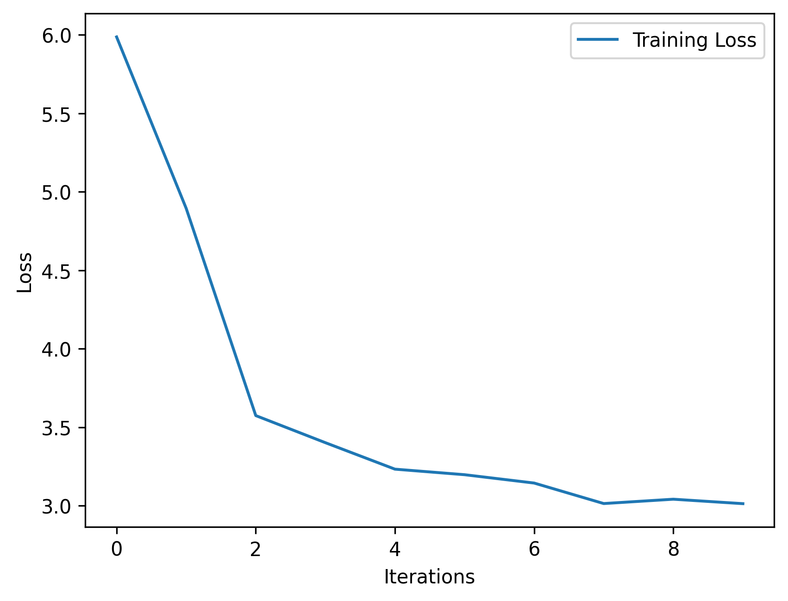

# LoRA+GPT2+jittor

本项目利用jittor框架在loRA原论文（https://github.com/microsoft/LoRA） 的基础之上，实现了其中的GPT2+LoRA的实验，并与pytorch版进行了对齐。

## 环境配置

ubuntu 24.04.2

jittor 1.3.9.2 

g++ 11


## 数据准备脚本

由于计算资源有限，本实验的数据从原实验数据中利用固定的种子随机抽取， 数据规模均缩小100倍。处理数据请运行：

```sh
bash create_datasets.sh
```

脚本内容：

```sh
#!/bin/bash

echo "creating e2e datasets..."
path=data/e2e
echo "train..."
python src/format_converting_e2e.py $path/train.txt $path/train_formatted.jsonl
python src/gpt2_encode.py --vocab vocab --input $path/train_formatted.jsonl --output $path/train.jsonl --add_bos --add_eos
echo "test..."
python src/format_converting_e2e.py $path/test.txt $path/test_formatted.jsonl
python src/gpt2_encode.py --vocab vocab --input $path/test_formatted.jsonl --output $path/test.jsonl --add_bos --add_eos

echo "valid..."
python src/format_converting_e2e.py $path/valid.txt $path/valid_formatted.jsonl
python src/gpt2_encode.py --vocab vocab --input $path/valid_formatted.jsonl --output $path/valid.jsonl --add_bos --add_eos


echo "script complete!"
```


## 训练脚本与测试脚本

work.sh脚本包含了本次实验的主要内容，分为四个步骤：训练（微调）、测试（推理）、解码、计算指标。请运行：

```sh
bash work.sh
```

脚本内容：

```sh
#计算资源不够，没办法
#export JT_SAVE_MEM=1
#export cpu_mem_limit=16000000000
#export device_mem_limit=7000000000
#
##查看异步报错
#export JT_SYNC=1
#export trace_py_var=3
#微调
python src/gpt2_ft.py \
    --train_data ./data/e2e/train.jsonl \
    --valid_data ./data/e2e/valid.jsonl \
    --train_batch_size 2 \
    --grad_acc 2 \
    --valid_batch_size 1 \
    --seq_len 64 \
    --model_card gpt2.sm \
    --init_checkpoint ./pretrained_checkpoints/gpt2-pytorch_model.bin \
    --clip 0.0 \
    --lr 0.0002 \
    --weight_decay 0.01 \
    --adam_beta2 0.999 \
    --scheduler linear \
    --warmup_step 500 \
    --max_epoch 5 \
    --save_interval 1000 \
    --lora_dim 4 \
    --lora_alpha 32 \
    --lora_dropout 0.1 \
    --label_smooth 0.1 \
    --work_dir ./trained_models/GPT2_M/e2e \
    --random_seed 2025

#推理测试
python src/gpt2_beam.py \
    --data ./data/e2e/test.jsonl \
    --batch_size 1 \
    --seq_len 64 \
    --eval_len 32 \
    --model_card gpt2.sm \
    --init_checkpoint ./trained_models/GPT2_M/e2e/model.1050.pt \
    --lora_dim 4 \
    --lora_alpha 32 \
    --beam 10 \
    --length_penalty 0.8 \
    --no_repeat_ngram_size 4 \
    --repetition_penalty 1.0 \
    --eos_token_id 628 \
    --work_dir ./trained_models/GPT2_M/e2e \
    --output_file predict.1050.b10p08r4.jsonl


#解码
python src/gpt2_decode.py \
    --vocab ./vocab \
    --sample_file ./trained_models/GPT2_M/e2e/predict.1050.b10p08r4.jsonl \
    --input_file ./data/e2e/test_formatted.jsonl \
    --output_ref_file e2e_ref.txt \
    --output_pred_file e2e_pred.txt

#计算指标
python eval/e2e/measure_scores.py e2e_ref.txt e2e_pred.txt -p
```

## 对齐实验

本次实验与pytorch版在不同的数据集上均实现了基本对齐。具体的log细节请参考logs文件夹下的log文件，同时，loss曲线也放入了loss文件夹下。

### E2E

##### 实验与性能对比图如下：


##### jittor版loss曲线：




##### pytorch版loss曲线：


## 复现步骤

安装环境、GPT2的checkpoint、处理数据集。

```
pip install -r requirement.txt
bash download_pretrained_checkpoints.sh
bash create_datasets.sh
```

然后进入eval文件夹后，运行以下命令，去下载评估的工具。

```sh
bash download_evalscript.sh
```

然后根据不同的数据集运行不同的脚本。

##### e2e

直接运行work.sh脚本即可。

```
bash work.sh
```